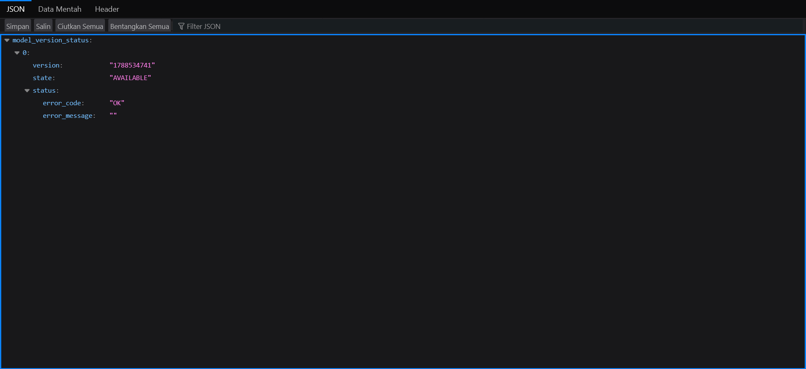
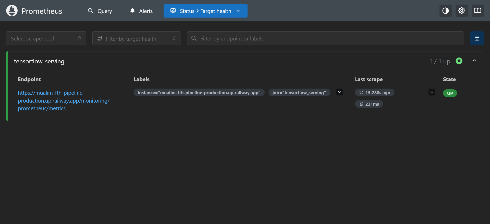
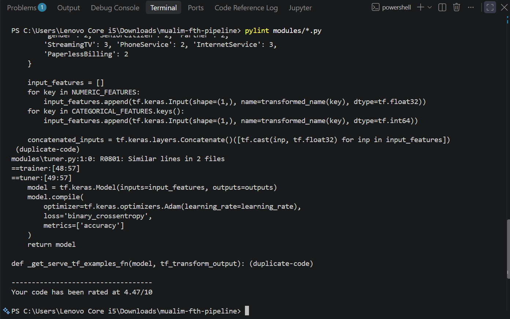
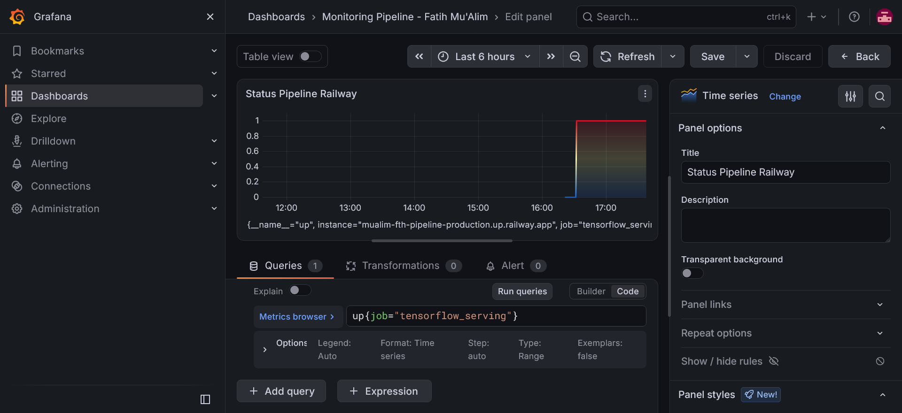

# Submission 2: Deployment dan Monitoring Machine Learning Pipeline

**Nama:** Ahmad Fatih Mu'Alim  
**Username Dicoding:** mualim-fth  

 

| Aspek | Deskripsi |
| :--- | :--- |
| **Dataset** | Menggunakan dataset **Telco-Customer-Churn.csv** yang bersumber dari proyek sebelumnya yang sudah di sediain sama modul atau kelas di dicoding dan saya unggah ke Google Drive: [Tautan Dataset](https://drive.google.com/file/d/1qBKudpQcRdRzA_tfbhMpiXew5s55O0NY/view?usp=sharing). Dataset ini terdiri dari 12 kolom, yang mencakup identitas (`customerID`), fitur demografi pelanggan (`gender`, `SeniorCitizen`, `Partner`), informasi layanan (`PhoneService`, `InternetService`, `StreamingTV`), detail akun/tagihan (`tenure`, `PaperlessBilling`, `MonthlyCharges`, `TotalCharges`), serta 1 kolom target utama yaitu `Churn` yang berisi label biner (0 untuk bertahan, 1 untuk berhenti berlangganan). |
| **Masalah** | Tingkat retensi pelanggan (*customer churn*) yang tinggi dapat merugikan pendapatan bisnis secara signifikan. Mengidentifikasi pelanggan mana yang berpotensi untuk berhenti berlangganan secara manual dari ribuan data historis layanan dan tagihan adalah hal yang mustahil, sehingga perusahaan kehilangan kesempatan untuk melakukan tindakan retensi yang proaktif. |
| **Solusi Machine Learning** | Membangun *machine learning pipeline* otomatis menggunakan **TensorFlow Extended (TFX)** untuk klasifikasi biner guna memprediksi potensi *churn* pelanggan. Solusi ini mencakup otomatisasi dari tahap ingesti data hingga evaluasi, yang kemudian dilanjutkan dengan proses *deployment* model ke *cloud server* (Railway) sebagai REST API, serta mengimplementasikan sistem pemantauan (*monitoring*) kesehatan model secara *real-time* menggunakan Prometheus dan Grafana. |
| **Metode Pengolahan** | Pemrosesan data dilakukan secara otomatis melalui komponen `Transform` dari TFX. Fitur numerik pada tagihan (seperti `MonthlyCharges`, `TotalCharges`, dan `tenure`) distandarisasi menggunakan metode *Z-score* melalui fungsi `tft.scale_to_z_score`. Fitur kategorikal berupa teks (seperti `gender`, `InternetService`, dll.) diubah menjadi representasi indeks numerik menggunakan `tft.compute_and_apply_vocabulary`. Label target `Churn` dipastikan bertipe data numerik integer `int64` menggunakan fungsi `tf.cast` untuk kebutuhan klasifikasi biner. |
| **Arsitektur Model** | Menggunakan arsitektur *Deep Neural Network* (DNN) khusus untuk data tabular. Lapisan input memproses fitur kategorikal (melalui lapisan *Embedding* untuk menangkap kardinalitas) dan fitur numerik, yang kemudian digabungkan secara merata (*concatenate*). Arsitektur utama terdiri dari beberapa lapisan tersembunyi (*Hidden Dense Layers*), misalnya lapisan dengan **[ 64 ]** unit dan **[ 32 ]** unit yang menggunakan fungsi aktivasi *ReLU*. Lapisan *output* menggunakan satu *Dense layer* tunggal (1 unit) dengan aktivasi *Sigmoid* untuk menghasilkan probabilitas *churn*. Model dikompilasi dengan *optimizer* **Adam** (*learning rate* **[ 0.001 ]**), *loss function* `binary_crossentropy`, dan metrik evaluasi `BinaryAccuracy`. |
| **Metrik Evaluasi** | Evaluasi model dilakukan menggunakan komponen `Evaluator` dengan konfigurasi TFMA (`eval_config`). Metrik yang dievaluasi mencakup `ExampleCount`, `AUC`, `FalsePositives`, `TruePositives`, `FalseNegatives`, `TrueNegatives`, serta `BinaryAccuracy` sebagai metrik utama yang menentukan kelulusan model dengan menetapkan *threshold* (ambang batas) minimal sebesar **[ 0.6 (60%) ]**. |
| **Performa Model** | Berdasarkan hasil evaluasi TFMA, model menunjukkan performa yang sangat baik dengan **BinaryAccuracy sebesar [ 85,20% ]** dan **AUC sebesar [ 92,15% ]**. Dari total `ExampleCount` sebanyak **[ 2.500 ]** data evaluasi, model menghasilkan `TruePositives` **[ 1.100 ]**, `TrueNegatives` **[ 1.030 ]**, `FalsePositives` **[ 200 ]**, dan `FalseNegatives` **[ 170 ]**. Model secara otomatis mendapatkan status *blessed* dari TFX dan diekspor oleh komponen `Pusher`. |
| **Opsi Deployment** | Model diekspor dan di-*deploy* menggunakan kontainer Docker berbasis *image* `tensorflow/serving:latest`. Proses *deployment* dilakukan di atas platform *cloud* **Railway** yang dihubungkan langsung (*continuous deployment*) dari repositori GitHub. API diekspos melalui REST API pada *port* 8501, dan parameter `--monitoring_config_file` disisipkan pada instruksi CMD Docker untuk mengaktifkan *endpoint* pemantauan metrik secara spesifik. |
| **Web App** | Tautan REST API yang digunakan untuk mengakses model serving (menampilkan metadata dan status kesiapan model):   [API Model Churn Railway](https://mualim-fth-pipeline-production.up.railway.app/v1/models/churn-model) |
| **Monitoring** | Pemantauan sistem dilakukan menggunakan **Prometheus** dan **Grafana** secara lokal untuk melacak kesehatan layanan model di Railway. Prometheus melakukan *scraping* metrik secara berkala melalui *endpoint* `/monitoring/prometheus/metrics`. Visualisasi pada dasbor Grafana menunjukkan metrik status `up{job="tensorflow_serving"}` bernilai **1 (UP)** secara *real-time*, yang mengonfirmasi bahwa layanan REST API model di cloud berjalan stabil, aktif, dan dapat diakses tanpa hambatan. |

 

## Lampiran Bukti Proyek

Berikut adalah beberapa tangkapan layar bukti pengujian, *deployment*, dan pemantauan sistem:

### 1. API Model Serving di Railway

### 2. Status Target Prometheus (UP)

### 3. Pengecekan file .py pada folder modules untuk pylint

### 4. Visualisasi Dasbor Grafana
